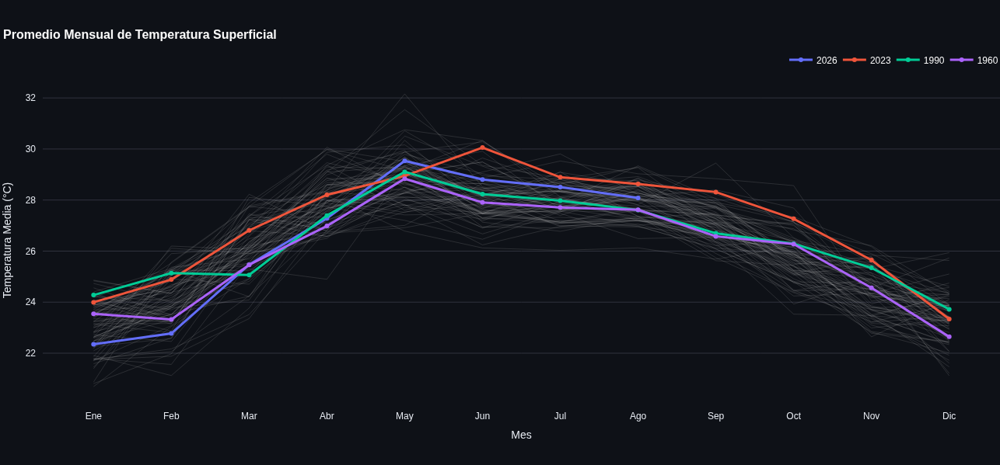
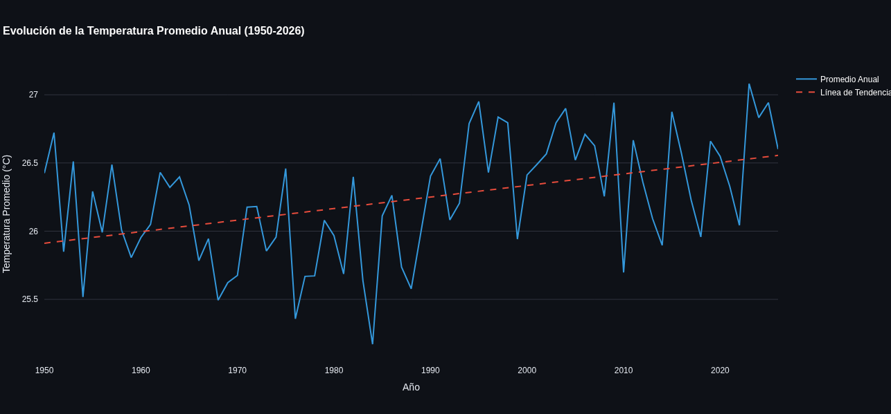

# Análisis del Incremento de Temperaturas y la Isla de Calor en Mérida, Yucatán 🌡️📈

[](https://TU-ENLACE-AQUI.streamlit.app/)


... 

Este proyecto de Ciencia de Datos analiza la evolución histórica de las temperaturas medias en Mérida, Yucatán, desde 1950 hasta 2026, utilizando datos de reanálisis climático del modelo **ERA5 (Copernicus/ECMWF)** obtenidos mediante la API de Open-Meteo.

El proyecto correlaciona el incremento térmico estadístico con el crecimiento desmedido de la **mancha urbana** y el fenómeno de la **Isla de Calor Urbana (ICU)**.

## Características del Proyecto
* **Extracción de Datos:** Consumo de la API de Open-Meteo (Historical Weather).
* **Procesamiento (ETL):** Uso de `pandas` para transformar datos diarios en promedios y anomalías mensuales/anuales.
* **Dashboard Interactivo:** Aplicación web desarrollada con `Streamlit` y `Plotly` para explorar y comparar las curvas de temperatura de cualquier año histórico frente a años recientes (como los récords de 2023 y 2026).
* **Análisis Estadístico:** Cálculo automatizado de la tasa de calentamiento por década (Regresión Lineal).

## Marco Teórico
De acuerdo con investigaciones recientes de la UNAM (2025/2026), Mérida duplicó su mancha urbana entre 2000 y 2020. Este crecimiento disperso e impulsado por el auge inmobiliario (con más de 300 desarrollos habitacionales nuevos) ha provocado la pérdida anual de más de 200 hectáreas de selvas y montes. La sustitución de vegetación natural por asfalto impide la evapotranspiración, generando un efecto de *Isla de Calor* que puede aumentar la temperatura local hasta en 3.9 °C.
## 👁️ Vista Previa del Dashboard

Aquí puedes ver el dashboard en acción:






## Cómo ejecutar el Dashboard Localmente

1. Clona este repositorio o descarga los archivos.
2. Crea un entorno virtual (recomendado) e instala las dependencias:
   ```bash
   pip install -r requirements.txt
   ```
3. Ejecuta la aplicación de Streamlit:
   ```bash
   streamlit run app.py
   ```
4. Abre tu navegador web en la dirección `http://localhost:8501`.
